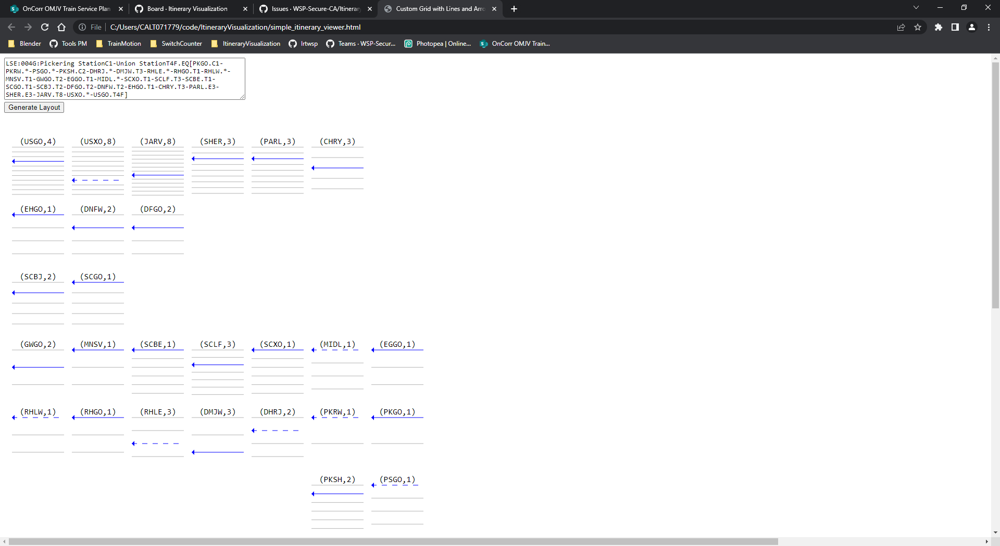
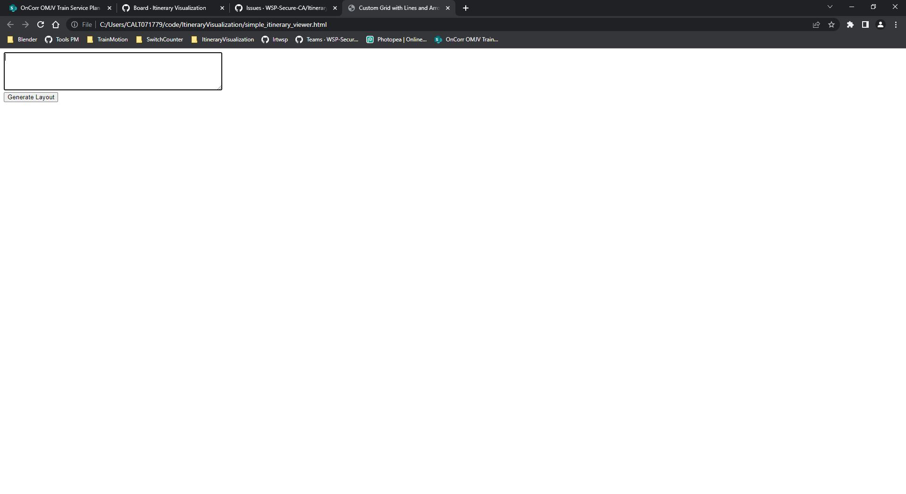
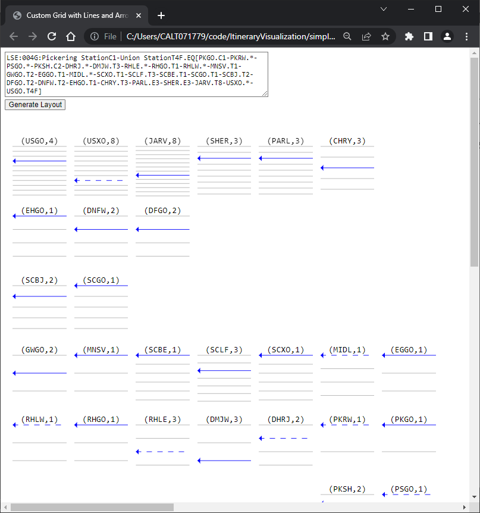

<h2>Slide 1</h2>

Simple Itinerary Viewer

2023-11-08

<table><tr><td>

</td><td style="vertical-align: top;">
<em>Slide 1 Image</em>
</td></tr></table>

<h2>Slide 2</h2>

Outline

Objective
Methodology 
Installation
How to Use
Features

<h2>Slide 3</h2>

Objective

<h2>Slide 4</h2>

Objective

To provide a simple method for modellers to visualize the location and track numbers in an itinerary. 

<table><tr><td>

</td><td style="vertical-align: top;">
<em>Slide 4 Image</em>
</td></tr></table>

<h2>Slide 5</h2>

Methodology

<h2>Slide 6</h2>

Methodology

The tool is a self-contained website that uses JavaScript to process the itinerary into JSON objects. 
It then displays that data visually using SVG in the canvas tag. 
The data is visualized as grids of locations with horizontal lines for the tracks. 
The track identified in the itinerary string is made dark blue. Dashed blue lines represent guesses for locations that have * for the tracks. 
The direction of travelled is inferred from the corridor name and order of the locations. 

<h2>Slide 7</h2>

Installation

<h2>Slide 8</h2>

Installation

No installation required. Just open the html file titled “simple_itinerary_viewer.html” in a browser that supports JavaScript (Firefox, Chrome, or Edge). Paste the full itinerary string in the input box and click Generate Layout.  

<table><tr><td>

</td><td style="vertical-align: top;">
<em>Slide 8 Image</em>
</td></tr></table>

LSE:004G:Pickering StationC1-Union StationT4F.EQ[PKGO.C1-PKRW.*-PSGO.*-PKSH.C2-DHRJ.*-DMJW.T3-RHLE.*-RHGO.T1-RHLW.*-MNSV.T1-GWGO.T2-EGGO.T1-MIDL.*-SCXO.T1-SCLF.T3-SCBE.T1-SCGO.T1-SCBJ.T2-DFGO.T2-DNFW.T2-EHGO.T1-CHRY.T3-PARL.E3-SHER.E3-JARV.T8-USXO.*-USGO.T4F]

<table><tr><td>

</td><td style="vertical-align: top;">
<em>Slide 8 Image</em>
</td></tr></table>

<h2>Slide 9</h2>

How to Use

<h2>Slide 10</h2>

How to Use – Required Files

Open the html file titled “simple_itinerary_viewer.html” in a browser that supports JavaScript (Firefox, Chrome, or Edge). Paste the full itinerary string in the input box and click Generate Layout.  

<table><tr><td>

</td><td style="vertical-align: top;">
<em>Slide 10 Image</em>
</td></tr></table>

LSE:004G:Pickering StationC1-Union StationT4F.EQ[PKGO.C1-PKRW.*-PSGO.*-PKSH.C2-DHRJ.*-DMJW.T3-RHLE.*-RHGO.T1-RHLW.*-MNSV.T1-GWGO.T2-EGGO.T1-MIDL.*-SCXO.T1-SCLF.T3-SCBE.T1-SCGO.T1-SCBJ.T2-DFGO.T2-DNFW.T2-EHGO.T1-CHRY.T3-PARL.E3-SHER.E3-JARV.T8-USXO.*-USGO.T4F]

<table><tr><td>

</td><td style="vertical-align: top;">
<em>Slide 10 Image</em>
</td></tr></table>

<h2>Slide 11</h2>

Features

<h2>Slide 12</h2>

Features

Shows # of tracks per location
Highlights the used track in dark blue
Direction is shown by the animation and arrow
Dashed lines indicate guessed tracks for locations with Asterix

<h2>Slide 13</h2>

Thank You

